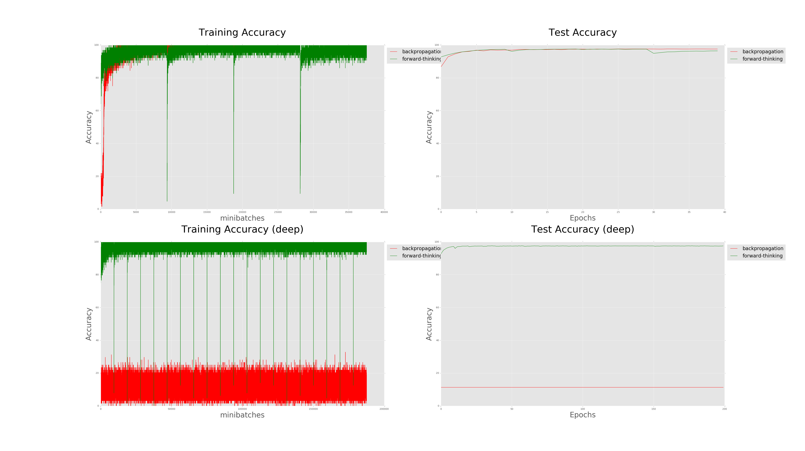

# forward-thinking-pytorch

Pytorch implementation of [Forward Thinking: Building and Training Neural Networks One Layer at a Time](https://arxiv.org/pdf/1706.02480.pdf)

## Requirements

- Python 2.7
- [numpy](http://www.numpy.org/)
- [pytorch](http://pytorch.org/)
- [Matplotlib](https://matplotlib.org/users/installing.html)

## Usage

	  $ ./run.sh

to run forward-thinking & forward-thinking (deep) & backpropagation & backpropagation (deep).

For forward-thinking experiment (5 layers),

 	$ python forward_thinking.py
  
If you want to do this with very deep model (20 layers),  

 	$ python forward_thinking.py --epoch 200 --deep

As a comparison, learn by backpropagation:

  	$ python backpropagate.py

Backpropagate with very deep model (20 layers),

  	$ python backpropagate.py --epoch 200 --deep

## Result

For 5 layers, forward-thinking learns slightly faster than backpropagation. Dips are observed when new layers are added.

When the model becomes very deep (20 layers), backpropagation cannot train the model. On the other hand, forward-thinking can train the model as usual.

